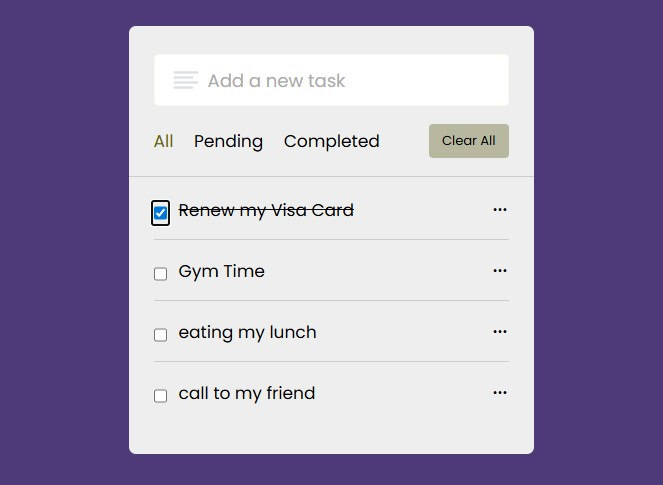

# ToDo List App

A simple, lightweight ToDo List web app built with plain HTML, CSS, and JavaScript. This repository contains a minimal, easy-to-use todo list that demonstrates DOM manipulation, event handling, and simple client-side state.

**Live Preview**

**Features**

- Add and remove tasks
- Mark tasks as completed
- Responsive, minimal UI

**Getting Started**

1. Clone the repository or download the project files.
2. Open `index.html` in your browser (no build step required).

**Usage**

- Type a task into the input field and press the Add button or Enter.
- Click the delete icon or button to remove a task.
- Click a task to toggle its completed state.

**Project files**

- `index.html` — main HTML file
- `Style.css` — styles for the app
- `JavaScript.js` — app logic and event handling
- `images/` — project assets (includes the preview image `Preview.jpg`)

**Author**: [WailHassan](https://github.com/wailhassan)
